# 微一案代码块
### 前言
为了提高开发效率，我们针对组件库内容整理代码块（Templates），命名为wya_templates
### 配置步骤
将wya_templates文件添加到...\.AndroidStudioX.X\config\templates路径下，然后重启android studio就可以在setting中看到如下内容

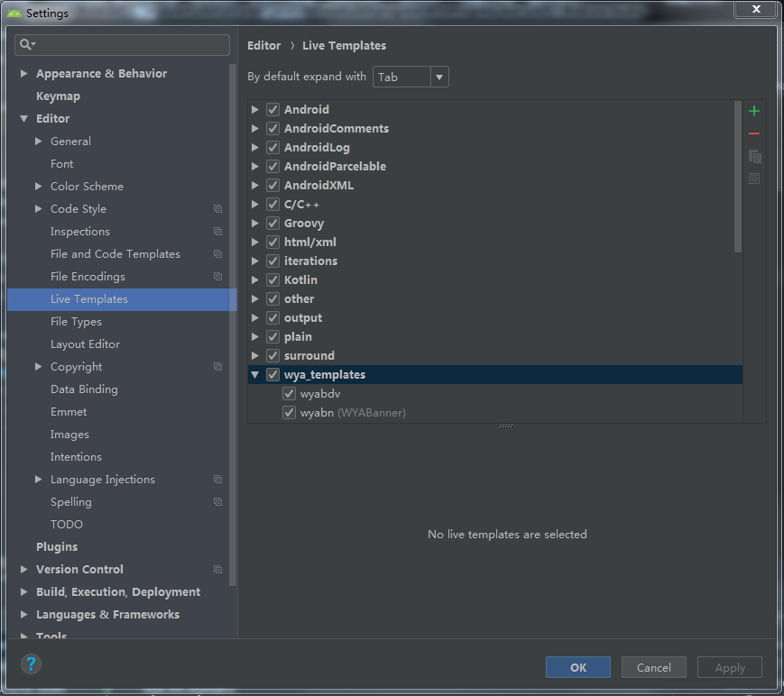

### 使用说明
- wyabdv

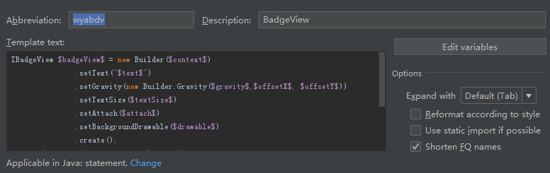

- wyabn

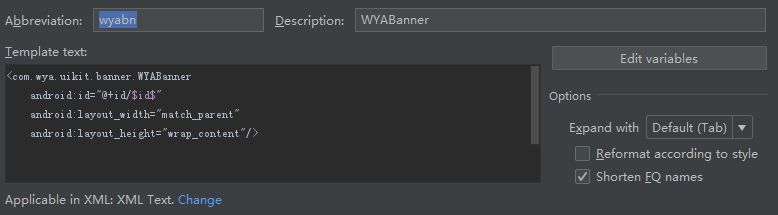

- wyabtn

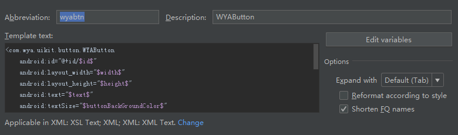

- wyacd

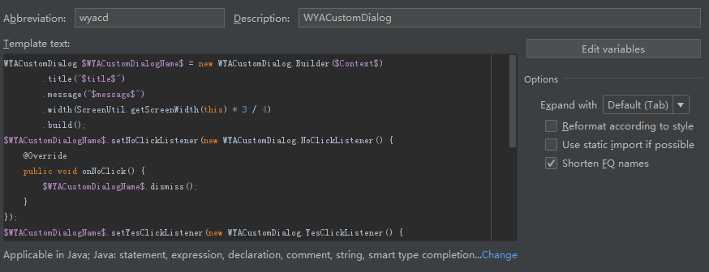

- wyacrop

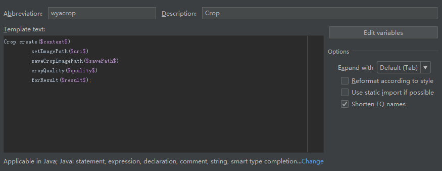

- wyact

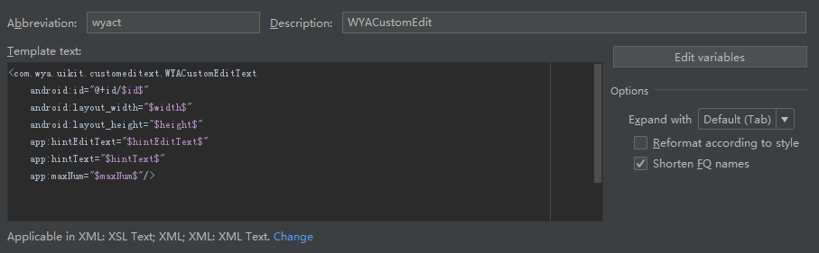

- wyagc

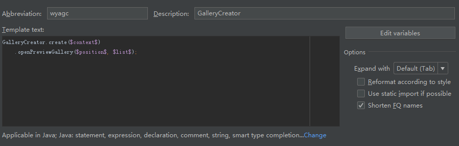

- wyaipc

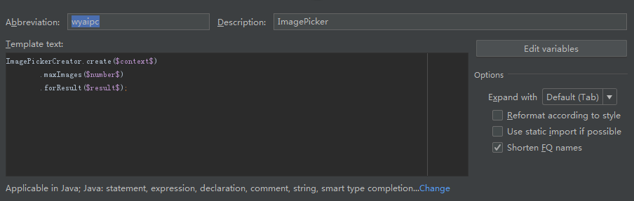

- wyamqtv

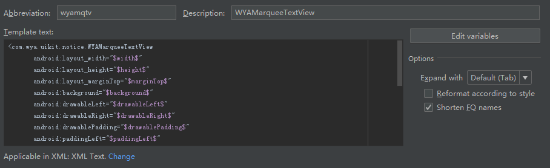

- wyapbv

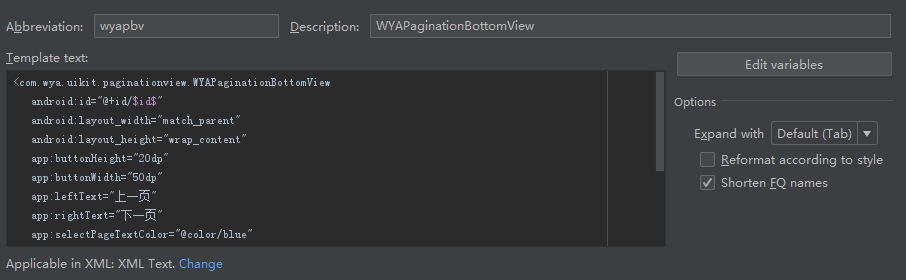

- wyapd

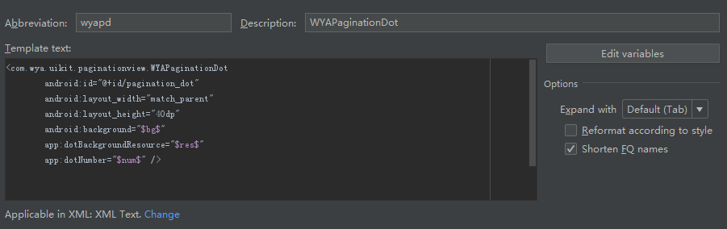

- wyapro

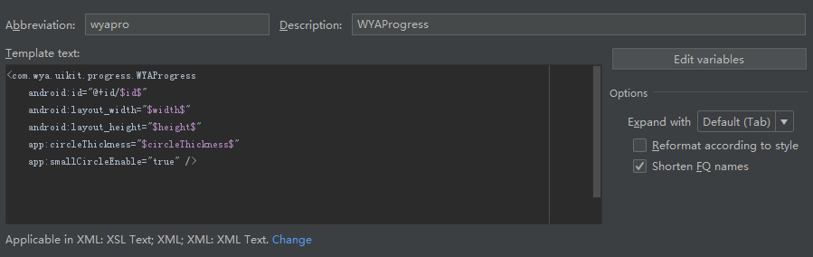

- wyapw

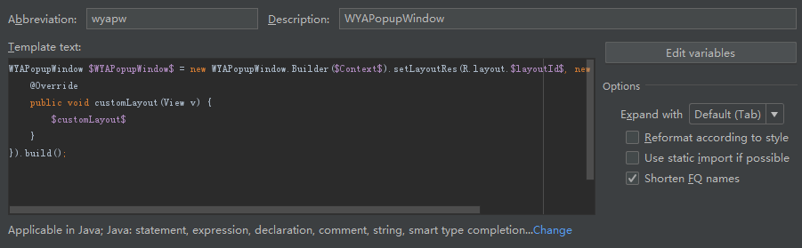

- wyasb

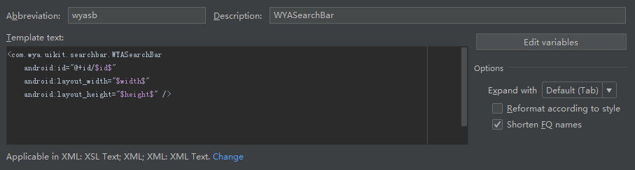

- wyasl

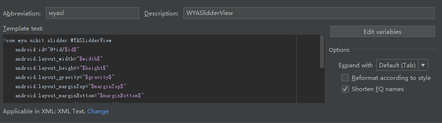

- wyast

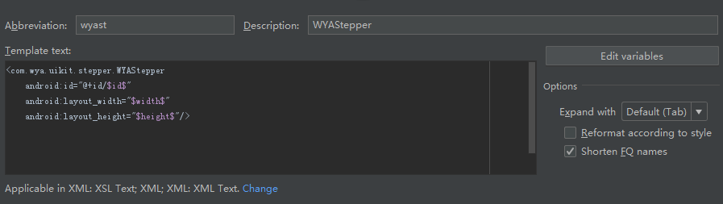

- wyasv

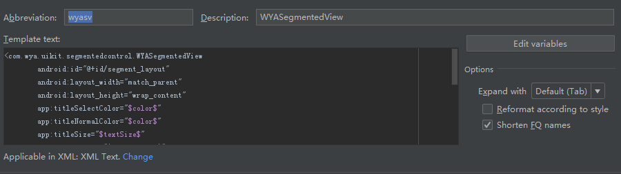

- wyaswv

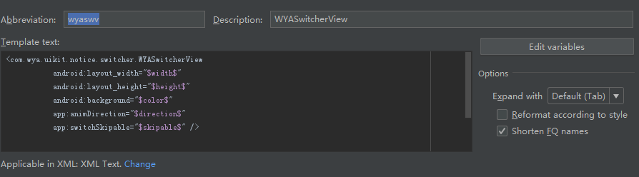

- wyatb

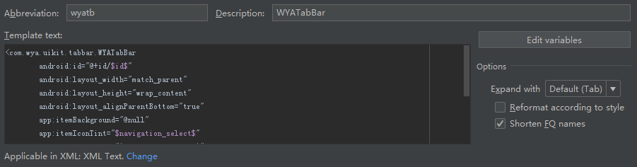

